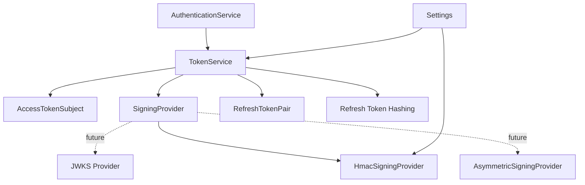
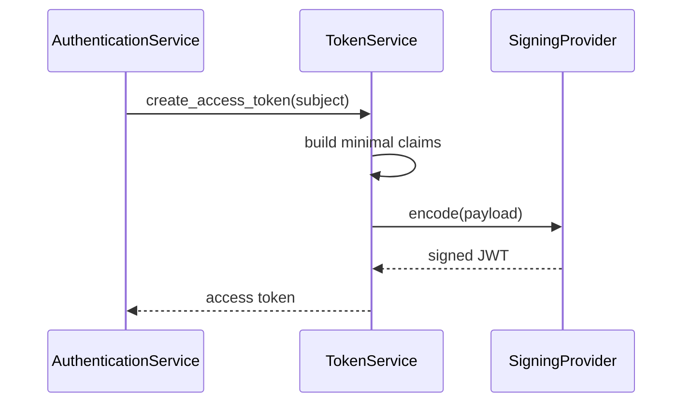
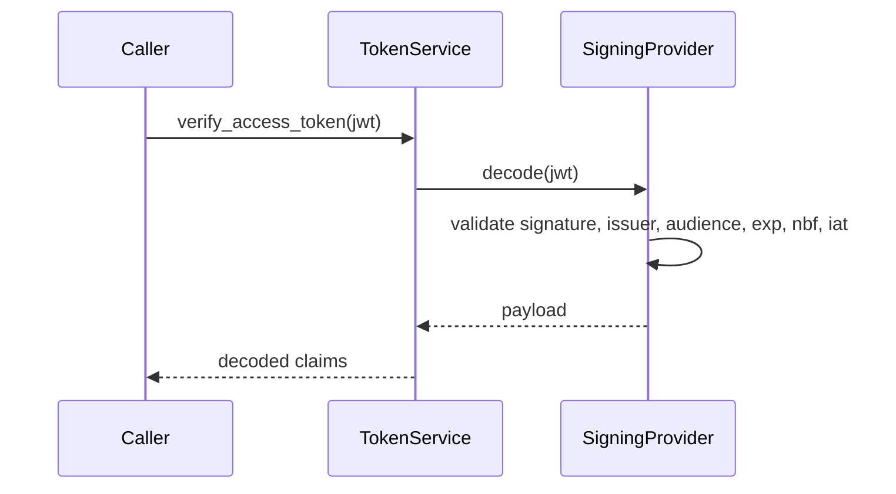
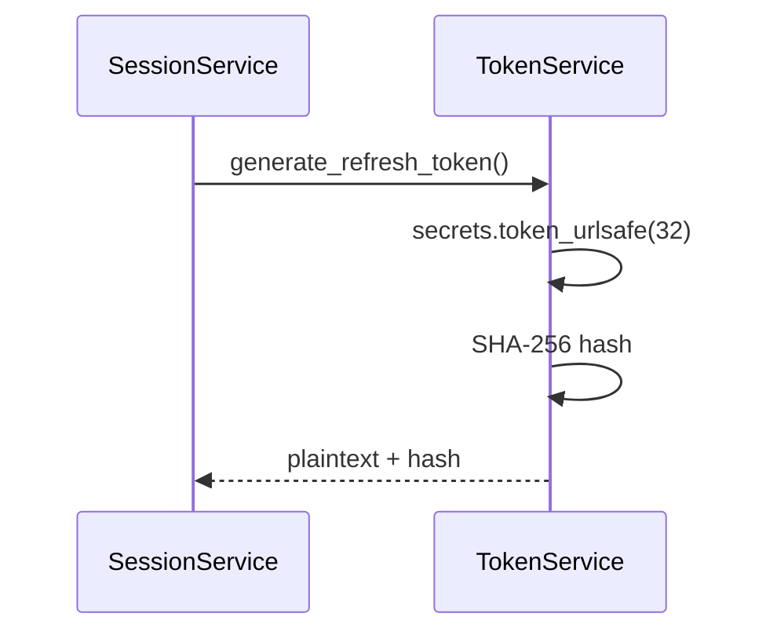

# PR-1.2.2 Engineering Design Document

Title: PR-1.2.2 - Token Infrastructure
Status: Implemented/Closed
Date: 2026-07-30

## 1. Scope

PR-1.2.2 strengthens the token subsystem created in PR-1.2.1. It focuses on access-token issuance and verification, refresh-token primitives, signing abstraction, configuration safety, and token-specific validation.

This slice does not implement authentication middleware, authorization middleware, provider OAuth, identity linking, or user-facing authentication APIs.

## 2. Goals

- Formalize token infrastructure behind stable interfaces.
- Preserve minimal JWT claims as required by ADR-008.
- Keep roles, permissions, mailbox IDs, provider tokens, and authorization data out of JWTs.
- Strengthen signing-key configuration and production safety checks.
- Prepare the codebase for future asymmetric signing and JWKS without changing callers.
- Improve token-specific tests around claim validation, issuer/audience, expiry, malformed tokens, and signing-provider substitution.
- Preserve opaque refresh-token generation and hashing behavior.

## 3. Non-Goals

- No Microsoft Entra ID OAuth.
- No Google/OIDC/SAML provider implementation.
- No login/callback endpoints.
- No authentication middleware.
- No authorization middleware.
- No `PolicyEngine` implementation.
- No durable audit-log sink.
- No provider credential encryption.
- No database schema changes unless a narrowly scoped token field is required and approved separately.

## 4. Architecture

PR-1.2.2 keeps token concerns isolated in the auth package.

```text
AuthenticationService
        |
        v
TokenService
        |
        v
SigningProvider interface
        |
        +-- HmacSigningProvider today
        +-- Future: AsymmetricSigningProvider
        +-- Future: JwksSigningProvider
```

`TokenService` remains responsible for constructing token payloads and mapping verification errors to domain exceptions. `SigningProvider` remains responsible for cryptographic encode/decode mechanics.

## 5. Component Diagram



## 6. Token Issuance Sequence



## 7. Token Verification Sequence



## 8. Refresh Token Sequence



## 9. Public Interfaces

### AccessTokenSubject

Stable input object for access-token creation.

Fields:

- `user_id`
- `tenant_id`
- `organization_id`
- `session_id`

### SigningProvider

Methods:

- `encode(payload) -> str`
- `decode(token) -> dict[str, Any]`

Rules:

- Implementations must validate supported algorithms explicitly.
- Implementations must reject unsigned or algorithm-confusion tokens.
- Implementations must validate issuer and audience.

### TokenService

Methods:

- `create_access_token(subject) -> str`
- `verify_access_token(token) -> dict[str, Any]`
- `generate_refresh_token() -> RefreshTokenPair`
- `hash_refresh_token(token) -> str`

## 10. Configuration Requirements

Required settings:

- `jwt_signing_secret`
- `jwt_algorithm`
- `jwt_issuer`
- `jwt_audience`
- `jwt_access_token_expire_minutes`
- `jwt_clock_skew_seconds`
- `jwt_refresh_token_expire_days`

Production safety:

- Production must reject the development signing secret.
- HS256 secrets must be at least 32 bytes.
- Unsupported algorithms must fail closed.
- Future asymmetric providers must not require changing `TokenService` callers.

## 11. Security Considerations

- JWTs must never contain roles, permissions, mailbox IDs, provider tokens, refresh tokens, or authorization data.
- Refresh tokens remain opaque random values, not JWTs.
- Refresh tokens are stored only as hashes.
- Token verification must validate issuer and audience.
- Token verification must require `exp`, `iat`, `nbf`, `iss`, `aud`, `sub`, and `jti`.
- Token signing failures must not leak secret material.
- Token verification failures must map to domain exceptions without leaking parser internals to API clients.

## 12. Validation Strategy

Tests should verify:

- Access token issuance succeeds with valid settings.
- Decoded claims include only approved fields.
- Roles and permissions are absent from JWTs.
- Expired tokens raise `TokenExpiredError`.
- Malformed tokens raise `TokenInvalidError`.
- Wrong signing secret fails verification.
- Wrong issuer fails verification.
- Wrong audience fails verification.
- Missing required claims fail verification.
- Refresh tokens are unique.
- Refresh-token hashing is deterministic.
- Refresh-token hash differs from plaintext.
- Weak/default signing secrets are rejected in production.
- Custom `SigningProvider` can be injected for tests/future providers.

Quality gates:

- Ruff check.
- Ruff format check.
- Mypy strict.
- Focused token tests.
- Existing PR-1.2.1 auth tests remain passing.

## 13. Implementation Order

1. Review current `TokenService`, `SigningProvider`, and auth settings.
2. Add production-safe token configuration validation.
3. Strengthen algorithm allow-list behavior.
4. Add tests for weak/default secret rejection.
5. Add tests for issuer/audience/missing-claim failures.
6. Add tests for custom `SigningProvider` injection.
7. Run focused quality gates.
8. Update traceability and changelog.

## 14. Definition of Done

PR-1.2.2 is complete when:

- Token infrastructure remains provider-agnostic.
- JWTs contain only approved claims.
- Roles and permissions are absent from tokens and covered by tests.
- Production configuration rejects unsafe defaults.
- Signing behavior is behind `SigningProvider`.
- Existing PR-1.2.1 tests still pass.
- New token infrastructure tests pass.
- Ruff and formatting pass.
- Mypy passes in a trusted environment.
- Documentation is updated.

## 15. Risks

| Risk | Mitigation |
| --- | --- |
| Accidentally expanding JWT claims | Keep explicit claim allow-list tests. |
| Hardcoding HS256 too deeply | Preserve `SigningProvider` injection boundary. |
| Weak local defaults reaching production | Add production-only validation. |
| Algorithm confusion | Explicit algorithm allow-list and decode configuration. |
| Over-expanding into middleware/API work | Keep this slice token-only. |

## 16. Merge Criteria

- No provider-specific code.
- No OAuth code.
- No authorization data in JWTs.
- No auth middleware/API implementation.
- All token-focused tests pass.
- Existing foundation behavior remains unchanged except for quality/safety hardening.
