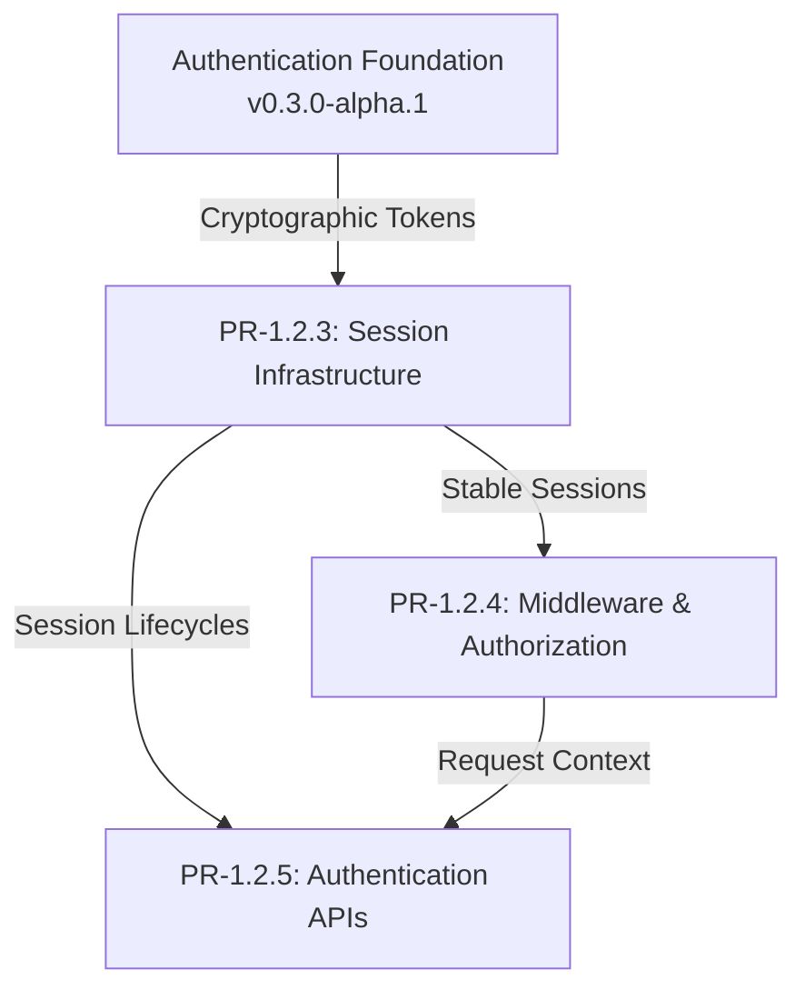

# PR-1.2.3 Engineering Design Document

Title: PR-1.2.3 - Session Infrastructure
Status: Kickoff
Date: 2026-08-07

## Objective

The Session Infrastructure slice is responsible for establishing a robust, durable device-session model that tracks live authentication sessions independently from cryptographic token refresh epochs. It resolves the primary technical debt from the Authentication Foundation by decoupling session identity from token rotation.

---

## Scope

The following features belong in PR-1.2.3:
- Stable device-session database model
- Refresh-token family model (or similar epoch-tracking mechanism)
- Session lifecycle management (creation, rotation, invalidation)
- Session versioning
- Session revocation (single session and all user sessions)
- Device metadata storage (e.g., user agent, IP tracking at session creation)
- Multi-device support for a single user
- Idle timeout enforcement
- Absolute timeout enforcement
- Session persistence improvements (database interaction optimizations)

---

## Out of Scope

The following are explicitly excluded from this slice:
- OAuth implementation
- Microsoft Entra ID provider integration
- Request-time authentication middleware
- Authorization middleware
- Policy Engine
- User-facing Authentication APIs (`/auth/*`)
- Mail synchronization
- Search
- AI reasoning

---

## Dependencies

**Depends Upon (Completed Modules):**
- Authentication Foundation (PR-1.2.1 / PR-1.2.2)
  - `TokenService`
  - `AuthenticationContext`
- Database/ORM Foundation (PR-1.1)

**Depended Upon By (Future Modules):**
- Middleware (PR-1.2.4) requires stable sessions to hydrate the request context.
- Authentication APIs (PR-1.2.5) require session infrastructure to complete user login flows.

### Dependency Graph

---

## Expected Deliverables

By the end of PR-1.2.3, the following components are expected:
- `DeviceSession` SQLAlchemy model (or equivalent)
- `RefreshTokenFamily` abstraction/model (if applicable)
- Database schema migration script (Alembic)
- Updated `SessionRepository`
- Updated `SessionManager` / `SessionService`
- Session validation and timeout logic
- Comprehensive Unit Tests for session rotation, timeouts, and revocation
- Integration Tests verifying database persistence
- Updated Technical Debt Register (resolving the refresh-epoch debt)
- Updated Documentation

---

## Risks

| Risk | Mitigation |
| :--- | :--- |
| **Data Migration Complexity:** Updating the session schema might impact existing development data. | Create a clean Alembic migration. If necessary, provide a script to drop/recreate local development DBs since this is an alpha release with no production data. |
| **Concurrency & Race Conditions:** Concurrent token refreshes might trigger reuse detection erroneously. | Implement robust database locking (e.g., `SELECT FOR UPDATE`) or grace periods for refresh tokens. |
| **Performance Overhead:** Complex session validation could slow down future middleware. | Keep database indexes optimized on session tokens and design the schema for fast `O(1)` lookups. |

---

## Validation Gates

Before this slice can be merged, it must pass:
- 100% pass rate for focused Unit & Integration Tests.
- `ruff check` (Linter).
- `ruff format` (Formatter).
- `mypy --strict` (Type Checker) passing in CI (or locally if unblocked).
- Successful `alembic upgrade head` and `alembic downgrade base` in a test environment.

---

## Definition of Done

- [ ] `DeviceSession` database schema is designed, migrated, and applied.
- [ ] Session identity is fully decoupled from refresh-token rotation events.
- [ ] Timeout enforcement (idle and absolute) is fully functional.
- [ ] Multi-device tracking is supported.
- [ ] All expected deliverables are checked into the branch.
- [ ] All validation quality gates are passing.
- [ ] Technical debt register is updated to reflect the resolved session-epoch issue.
